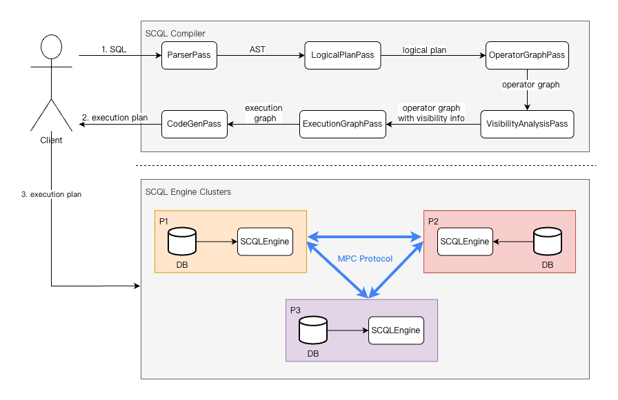

# SCQL

Secure Collaborative Query Language (SCQL) is a system that translates SQL statements into Secure Multiparty Computation (SMC) primitives and executes them on a federation of database systems.

## Documentation

- [Documentation in English](https://www.secretflow.org.cn/en/docs/scql)
- [中文文档](https://www.secretflow.org.cn/zh-CN/docs/scql/)

## Docker Image Release

- Official release docker image: [secretflow/scql](https://hub.docker.com/r/secretflow/scql/tags)
- We also have mirrors at Alibaba Cloud: secretflow-registry.cn-hangzhou.cr.aliyuncs.com/secretflow/scql:[tag]

## Contribution Guidelines

If you would like to contribute to SCQL, please see the [Contribution guidelines](CONTRIBUTING.md).

This documentation also contains instructions for [build and testing](CONTRIBUTING.md#build)

## Hardware Requirements

The following requirements only apply to SCQLEngine.

- CPU
  * x86_64: minimum required AVX instruction set. For FourQ based PSI, the AVX2 instruction set is required.

## Disclaimer

Non-release versions of SCQL are prohibited to use in any production environment due to possible bugs, glitches, lack of functionality, security issues or other problems.

## Acknowledgments

- Thanks [TiDB](https://github.com/pingcap/tidb) for providing a powerful SQL parser and planner.
