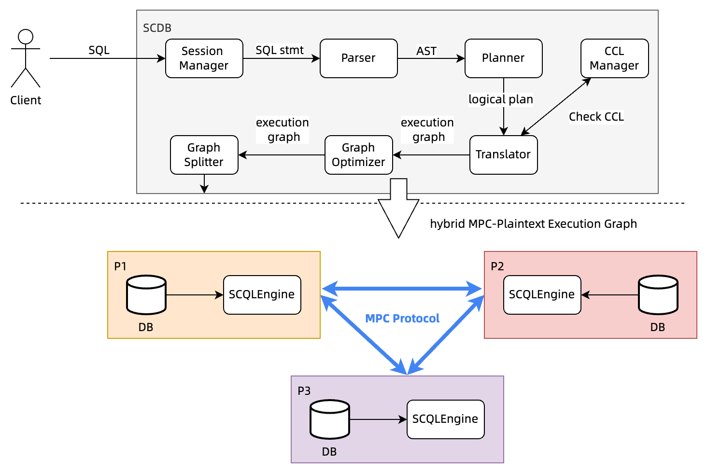

# SCQL

[](https://dl.circleci.com/status-badge/redirect/gh/secretflow/scql/tree/main)

Secure Collaborative Query Language (SCQL) is a system that translates SQL statements into Secure Multiparty Computation (SMC) primitives and executes them on a federation of database systems.



## Contents

- [Documentation](https://www.secretflow.org.cn/docs/scql/en/)
- [Build and Test](#build)

## Build

### Prerequisite

#### Docker

```sh
## start dev container
docker run -d -it --name scql-dev-$(whoami) \
         --mount type=bind,source="$(pwd)",target=/home/admin/dev/ \
         -w /home/admin/dev \
         --cap-add=SYS_PTRACE --security-opt seccomp=unconfined \
         --cap-add=NET_ADMIN \
         --privileged=true \
         secretflow/scql-ci:latest

# attach to dev container
docker exec -it scql-dev-$(whoami) bash
```

### Build & UnitTest


```sh
# build SCQL engine as release
bazel build //engine/exe:scqlengine -c opt

# test

# run unittests for SCQL engine
bazel test //engine/...

# build scdb code
make

# run scdb unit tests
go test ./...
```

### Build docs

```sh
# prerequisite
pip3 install -U -r docs/requirements.txt

# Build HTML docs, and the result is placed in directory 'docs/_build/html'
# Build documentation in English
make doc

# Build documentation in Chinese
make doc-cn
```

## Disclaimer

Non-release versions of SCQL are prohibited to use in any production environment due to possible bugs, glitches, lack of functionality, security issues or other problems.

## Acknowledgments

- Thanks [TiDB](https://github.com/pingcap/tidb) for providing a powerful SQL parser and planner.