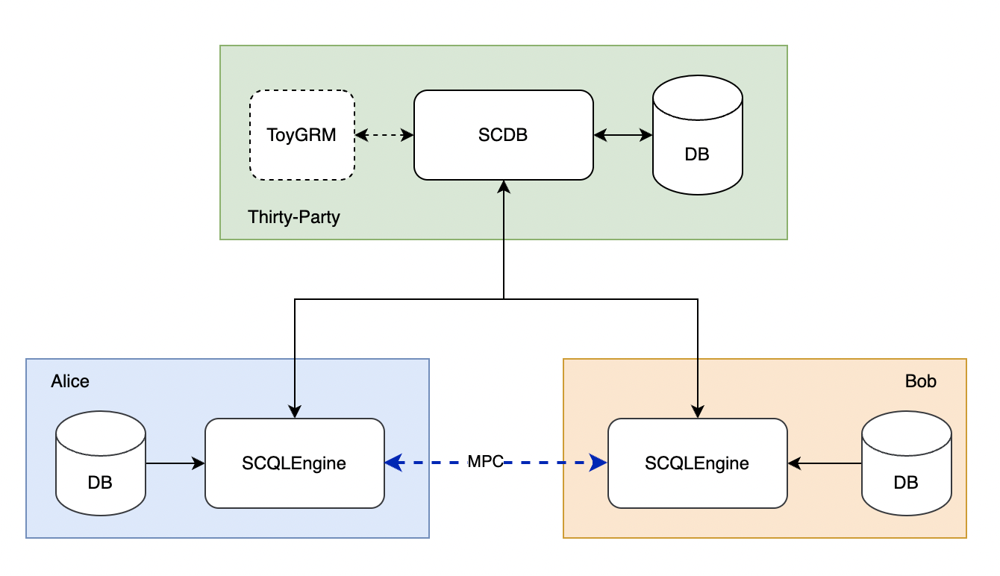

==========
Deployment
==========

This document describes how to deploy a SCQL system with docker, and use scdbclient to query, it's basically same with :doc:`quickstart`, but deployed in multi-machine. 

Before start this doc, we assume that the reader has some experience using the docker-compose utility. If you are new to Docker Compose, please consider reviewing the `official Docker Compose overview <https://docs.docker.com/compose/>`_, or checking out the `Getting Started guide <https://docs.docker.com/compose/gettingstarted/>`_.

Deployment Diagram
==================

The deployment diagram of the SCQL system that we plan to deploy is shown as the following figure, it involves a total of three party, including a trusted third-party and two data owner parties named ``Alice`` and ``Bob``. We use three machines to simulate different parties.

.. note::
    1. The SCDB is served through the HTTP protocol. It is recommended to use HTTPS instead in production environments. Please check :ref:`TLS Configuration <scdb-tls>` for details.
    2. Please note that while we used ToyGRM for the demo, it should not be used in production environments.

Step 1: Deploy SCQLEngine
==========================

Here we displayed how to deploy engine in party Alice, it's same with party Bob.

1.1 Create a Workspace
-----------------------

.. code-block:: bash

    mkdir engine
    cd engine

1.2 Set Dataset
---------------

The database in Engine is use to storage the origin data. In this document we will use MySQL as the database service, and simulate a dataset. However, if you prefer, you can use your preferred database service.

To simulate a dataset, you need create a sql init file named alice_init.sql in your workspace, which corresponds to `alice_init.sql <https://github.com/secretflow/scql/tree/main/examples/docker-compose/mysql/initdb/alice_init.sql>`_. For Bob, please use `bob_init.sql <https://github.com/secretflow/scql/tree/main/examples/docker-compose/mysql/initdb/bob_init.sql>`_ instead.

This file can also be obtained via the command-line with either curl, wget or another similar tool.

.. code-block:: bash

  wget raw.githubusercontent.com/secretflow/scql/main/examples/docker-compose/mysql/initdb/alice_init.sql

1.3 Set Engine Config
---------------------

Create a file called ``gflags.conf`` in your workspace and paste the following code in:

.. code-block:: bash

    --listen_port=8080
    --datasource_router=embed
    --enable_scdb_authorization=true
    --engine_credential=__ALICE_CREDENTIAL__
    --server_enable_ssl=false
    --scdb_enable_ssl_as_client=false
    --peer_engine_enable_ssl_as_client=false
    --embed_router_conf={"datasources":[{"id":"ds001","name":"mysql db","kind":"MYSQL","connection_str":"db=alice;user=root;password=testpass;host=mysql;auto-reconnect=true"}],"rules":[{"db":"*","table":"*","datasource_id":"ds001"}]}

See :ref:`Engine configuration options <engine_config_options>` for more config information

.. note::

  The ``connection_str`` specified in ``embed_router_conf`` is utilized to connect database named alice as set in `1.2 Set Dataset`_, For Bob it should be set to connect database named bob.

  ``__ALICE_CREDENTIAL__`` is used to authenticate SCDB, you need replace it with your own credential, same with Bob. In our example, we have simply set it as ``credential_alice`` for Alice, and ``credential_bob`` for Bob.

1.4 Create docker-compose file
------------------------------

Create a file called ``docker-compose.yaml`` in your workspace and paste the following code in:

.. code-block:: yaml

  version: "3.8"
  services:
    engine:
      cap_add:
        - NET_ADMIN
      command:
        - /home/admin/bin/scqlengine
        - --flagfile=/home/admin/engine/conf/gflags.conf
      restart: always
      image: secretflow/scql:latest
      ports:
        - __ALICE_PORT__:8080
      volumes:
        - ./gflags.conf:/home/admin/engine/conf/gflags.conf
    mysql:
      image: mysql:latest
      environment:
        - MYSQL_ROOT_PASSWORD=testpass
        - TZ=Asia/Shanghai
      healthcheck:
        retries: 10
        test:
          - CMD
          - mysqladmin
          - ping
          - -h
          - mysql
        timeout: 20s
      expose:
        - "3306"
      restart: always
      volumes:
        - ./alice_init.sql:/docker-entrypoint-initdb.d/alice_init.sql

.. note::

  ``__ALICE_PORT__``  is the published port on the host machine which is used for engine service to listen on, you need to replace it with an accessible port number. In this case, we have designated it as ``8080``

  Container *mysql* is init by ``alice_init.sql`` as set in `1.2 Set Dataset`_ , it should be ``bob_init.sql`` for Bob. If you use your own database service, container *mysql* can be deleted

1.5 Start Engine Service
------------------------

The file your workspace should be as follows:

.. code-block:: bash

  └── engine
    ├── alice_init.sql
    ├── gflags.conf
    └── docker-compose.yaml

Then you can start engine service by running docker compose up

.. code-block:: bash

  # If you install docker with Compose V1, pleas use `docker-compose` instead of `docker compose`
  $ docker compose -f docker-compose.yaml up -d

  Creating network "engine_default" with the default driver
  Creating engine_engine_1 ... done
  Creating engine_mysql_1  ... done

You can use docker logs to check whether engine works well

.. code-block:: bash

  $ docker logs -f engine_engine_1

  [info] [main.cc:main:297] Started engine rpc server success, listen on: 0.0.0.0:8080

SCQLEngine is listening on ``8080``.

Step 2: Deploy SCDB
===================

This chapter will demonstrate how to deploy SCDB in a Third-Party

2.1 Create a Workspace
----------------------

.. code-block:: bash

  mkdir scdb
  cd scdb

2.2 Set ToyGRM
--------------

We use toygrm instead of stdgrm for demo, which means the GRM services is simulated by reading local JSON files, it's not recommend in production environments. See :ref:`Global Resource Manager <grm>` for more information about GRM

Create a json file named ``toy_grm.json`` in your workspace, which should look like as follows:

.. code-block:: json

  {
    "engine": {
      "read_token": ["__ALICE_TOKEN__", "__BOB_TOKEN__"],
      "engines_info": [
        {
          "party": "alice",
          "url": ["__ENGINE_ALICE_HOST__:__ALICE_PORT__"],
          "credential": ["__ALICE_CREDENTIAL__"]
        },
        {
          "party": "bob",
          "url": ["__ENGINE_BOB_HOST__:__BOB_PORT__"],
          "credential": ["__BOB_CREDENTIAL__"]
        }
      ]
    },
    "table": {
      "read_token": ["__ALICE_TOKEN__", "__BOB_TOKEN__"],
      "ownerships": [
        { "tids": ["tid0"], "token": "__ALICE_TOKEN__" },
        { "tids": ["tid1"], "token": "__BOB_TOKEN__" }
      ],
      "table_schema": [
        {
          "tid": "tid0",
          "schema": {
            "ref_db_name": "alice",
            "ref_table_name": "user_credit",
            "columns": [
              { "column_name": "ID", "column_type": "string" },
              { "column_name": "credit_rank", "column_type": "long" },
              { "column_name": "income", "column_type": "long" },
              { "column_name": "age", "column_type": "long" }
            ]
          }
        },
        {
          "tid": "tid1",
          "schema": {
            "ref_db_name": "bob",
            "ref_table_name": "user_stats",
            "columns": [
              { "column_name": "ID", "column_type": "string" },
              { "column_name": "order_amount", "column_type": "float" },
              { "column_name": "is_active", "column_type": "long" }
            ]
          }
        }
      ]
    }
  }

.. note::

    ``__ALICE_TOKEN__`` and ``__BOB_TOKEN__`` is a string token used to authenticate the user, you should replace them with your own token information. Here it's set as ``token_alice`` and ``token_bob``.

    ``__ENGINE_ALICE_HOST__`` and ``__ENGINE_BOB_HOST__`` represent the IP addresses of Alice and Bob, you should replace these placeholders with your own IP address information.

    ``__ALICE_PORT__`` and ``__BOB_PORT__`` represent the listening ports of engine services and should match the published port specified in `1.4 Create docker-compose file`_. In this case it should be 8080.

    ``__ALICE_CREDENTIAL__`` and ``__BOB_CREDENTIAL__`` are used to identify SCDB when send request to engine, it should match the ``engine_credential`` specified in `1.3 Set Engine Config`_.  In this case it should be ``credential_alice`` and ``credential_bob``.

2.3 Set SCDB Config 
--------------------

Create a file called ``config.yml`` in your workspace and paste the following code in:

.. code-block:: yaml

  scdb_host: scdb:8080
  port: 8080
  protocol: http
  query_result_callback_timeout: 3m
  session_expire_time: 3m
  session_expire_check_time: 100ms
  log_level: debug
  storage:
    type: mysql
    conn_str: "root:testpass@tcp(mysql:3306)/scdb?charset=utf8mb4&parseTime=True&loc=Local&interpolateParams=true"
    max_idle_conns: 10
    max_open_conns: 100
    conn_max_idle_time: 2m
    conn_max_lifetime: 5m
  grm:
    grm_mode: toygrm
    toy_grm_conf: /home/admin/configs/toy_grm.json
  engine:
    timeout: 120s
    protocol: http
    content_type: application/json
    spu:
      protocol: SEMI2K
      field: FM64
      sigmoid_mode: SIGMOID_REAL

See :ref:`SCDB configuration options <scdb_config_options>` for more config information

.. note::

  ``conn_str`` is utilized to connect database named scdb which will be deployed in next step, if you prefer, you can also use your own database service.

2.4 Create docker-compose file
------------------------------

Create a file called ``docker-compose.yaml`` in your workspace and paste the following code in:

.. code-block:: yaml

  version: "3.8"
  services:
    scdb:
      image: secretflow/scql:latest
      environment:
        - SCQL_ROOT_PASSWORD=root
      command:
        - /home/admin/bin/scdbserver
        - -config=/home/admin/configs/config.yml
      restart: always
      ports:
        - __SCDB_PORT__:8080
      volumes:
        - ./config.yml:/home/admin/configs/config.yml
        - ./toy_grm.json:/home/admin/configs/toy_grm.json
    mysql:
      image: mysql:latest
      environment:
        - MYSQL_ROOT_PASSWORD=testpass
        - MYSQL_DATABASE=scdb
        - TZ=Asia/Shanghai
      healthcheck:
        retries: 10
        test:
          - CMD
          - mysqladmin
          - ping
          - -h
          - mysql
        timeout: 20s
      expose:
        - "3306"
      restart: always

.. note::

  ``__SCDB_PORT__`` is the published port on the host machine which is used for engine service to listen on , you need to replace it with an accessible port number. Here, it's set as 8080

2.5 Start SCDB Service
----------------------

The file your workspace should be as follows:

.. code-block:: bash

  └── scdb 
    ├── scdb_init.sql
    ├── config.yml
    ├── toy_grm.json
    └── docker-compose.yaml

Then you can start engine service by running docker compose up

.. code-block:: bash

  # If you install docker with Compose V1, pleas use `docker-compose` instead of `docker compose`
  $ docker compose -f docker-compose.yaml up -d

  Creating scdb_mysql_1 ... done
  Creating scdb_scdb_1  ... done

You can use docker logs to check whether engine works well

.. code-block:: bash

  $ docker logs -f scdb_scdb_1

  INFO main.go:122 Starting to serve request with http...

SCDB is listening on ``8080``, waiting for connection

Step 3: SCQL Test
=================

Here we use scdbclient to submit a query to SCDB for testing, you can also submit queries directly to SCDB by sending a POST request. This step can be completed on any machine that has access to the SCDB ip address. 

You can read `How to use SCDBClient <https://github.com/secretflow/scql/tree/main/cmd/scdbclient/README.md>`_ for more information about scdbclient.

3.1 Build scdbclient
--------------------

.. code-block:: bash

    # Grab a copy of scql:
    git clone git@github.com:secretflow/scql.git
    cd scql

    # build scdbclient from source
    # requirements:
    #   go version >= 1.19
    go build -o scdbclient cmd/scdbclient/main.go

    # try scdbclient
    ./scdbclient --help

3.2 Set Client Config
---------------------

Create a json file named as ``users.json`` as follows:

.. code-block:: json

  {
    "alice": {
      "UserName": "alice",
      "Password": "some_password",
      "GrmToken": "__ALICE_TOKEN__"
    },
    "bob": {
      "UserName": "bob",
      "Password": "another_password",
      "GrmToken": "__BOB_TOKEN__"
    },
    "root": {
      "UserName": "root",
      "Password": "root",
      "GrmToken": ""
    }
  }

.. note::

    The ``root`` user is the admin user of SCDB which is init when scdb container set up, ``alice`` and ``bob`` are the user belong to party Alice and Bob,

    The user information for ``alice`` and ``bob`` should be same with the user information you will create.

    ``__ALICE_TOKEN__`` and ``__BOB_TOKEN__`` is correspond to the token information set in `2.2 Set ToyGRM`_. In this case, it should be set as ``token_alice`` and ``token_bob``.

3.3 Submit Query
----------------

You can start to use scdbclient to submit queries to SCDBServer and fetch the query results back. it's same as what you can do in :doc:`quickstart`

.. code-block:: bash

    # use scdbclient to connect to scdbserver
    ./scdbclient prompt --host=__SCDB_URL__ --usersConfFileName=users.json --sync
    > switch root
    # create our first db demo
    root> create database demo
    [fetch] OK for DDL/DML
    root> show databases;
    [fetch]
    1 rows in set: (2.945772ms)
    +----------+
    | Database |
    +----------+
    | demo     |
    +----------+
    ...

.. note::
    ``__SCDB_URL__`` is the url (eg:http://127.0.0.1:8080) where scdb service is listen on, you need to replace it with scdb service url.