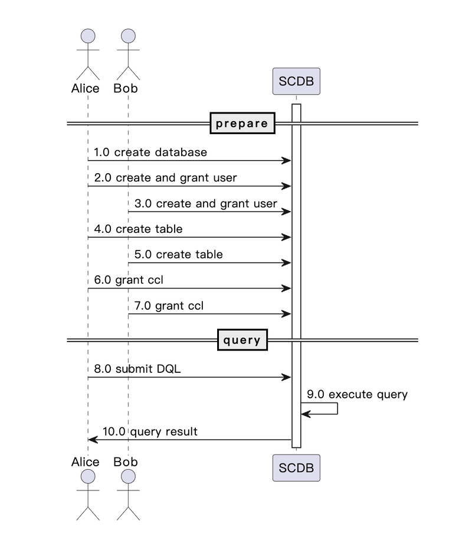

How To Use SCQL
===============

The flowchart shows how to use SCQL system, which contains two stages: prepare and query. In the prepare stage, the system is set up, and the necessary tables are created and initialized. In the query stage, queries are submitted, processed, and results are returned.

.. note::
   All requests from user to SCDB can be submitted through :ref:`synchronous api<sync_api>` or :ref:`asynchronous api<async_api>`.

Workflow
---------

Participants
------------

* Alice: the user in party alice
* Bob: the user in party bob
* Admin: the root user in SCDB
* GRM: Global Resource Manager
* SCDB: the SCDB server

Prepare stage
-------------

1.0 register information
    Information which contains table schema and engine information registered in :ref:`GRM <grm>`.

.. note::
    The specific process of this step depends on the implementation of GRM. For example, in ToyGRM, it just loads information from a JSON file.

2.0 create database
    The Admin actor creates a new database through :ref:`CREATE DATABASE Statement <create_database_stm>`, which can be considered a new project, , SCQL supports running multiple projects simultaneously.

3.0 create and grant user
    The Admin actor creates users Alice and Bob in SCDB by :ref:`CREATE USER Statement <create_user_stm>`, and grants access to the relevant database by :ref:`GRANT Statement <scql_grant_revoke>`

4.0 create table
    Alice creates table in SCDB by :ref:`CREATE TABLE Statement <create_table>`.

4.1 check table owner
    SCDB check if Alice is the owner of the table by send message to GRM through :ref:`VerifyTableOwnership <verify_table_ownership>`.

4.2 get table schema
    SCDB retrieves table schema information of the table created by Alice from GRM through :ref:`GetTableMeta <get_table_meta>`.

5.0 create table
    Bob creates table in SCDB by :ref:`CREATE TABLE Statement <create_table>`.

5.1 check table owner
    SCDB check if Bob is the owner of the table by send message to GRM through :ref:`VerifyTableOwnership <verify_table_ownership>`.

5.2 get table schema
    SCDB retrieves table schema information of the table created by Bob from GRM through :ref:`GetTableMeta <get_table_meta>`.

6.0 grant CCL
    Alice grants CCL about the table created by Alice for Alice and Bob in SCDB, see :ref:`CCL </reference/scql_ccl_intro.rst>` for more information.

6.1 grant CCL
    Bob grants CCL about the table created by Bob for Alice and Bob in SCDB, see :ref:`CCL </reference/scql_ccl_intro.rst>` for more information.

Execute stage
-------------

7.0 submit a DQL
    Alice submits a DQL to SCDB through :ref:`public/submit_query <submit_query>` or :ref:`public/submit_and_get <submit_and_get>`.

8.0 get engine information
    SCDB retrieves the engine information of the relevant parties from GRM through :ref:`GetEngines <get_engines>`.

9.0 process query
    SCDB will check ccl and execute query with engines.

10.0 return result
    SCDB return the query result to Alice.
