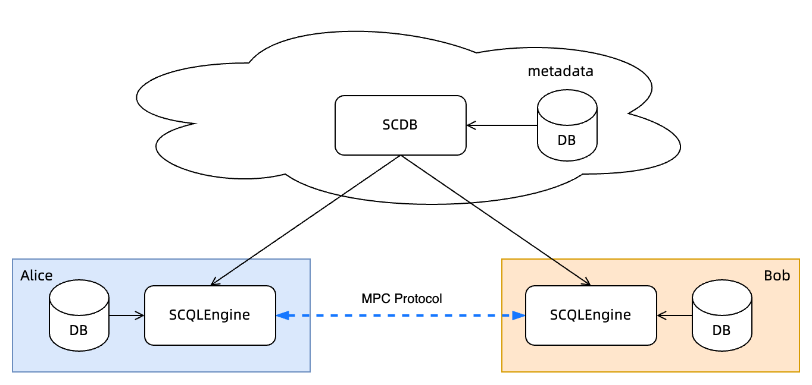

Quickstart
==========

TL;DR
-----

Use ``docker-compose`` to deploy a standalone SCQL, then use scdbclient to query

Prerequisites
-------------

Build scdbclient
^^^^^^^^^^^^^^^^

``scdbclient`` is a command-line client for SCDBServer, we would use it to submit queries to SCDBServer and fetch the query results back.

.. code-block:: bash

    # build scdbclient from source
    # requirements:
    #   go version >= 1.19
    go build -o scdbclient cmd/scdbclient/main.go

    # try scdbclient
    ./scdbclient --help

Register user information
^^^^^^^^^^^^^^^^^^^^^^^^^

Before starting the SCQL service, you need to initialize tokens and credentials in ToyGRM and put this information into user.json and engine's config file.

.. code-block:: bash

    bash examples/docker-compose/register.sh

Start SCQL Service
------------------

You could start SCQL service via `docker-compose <https://github.com/secretflow/scql/tree/main/examples/docker-compose>`_, it would deploy and start services as shown in the following figure, it contains a SCDBServer and two SCQLEngines from party ``alice``, ``bob``.

.. note:: 
    To demonstrate SCQL, we conducted the following simplified operations:

    1. The SCDBServer and two other SCQLEngines use the same database server but are separated by distinct database names.
    2. The SCDBServer is served through the HTTP protocol. However, for production environments, it is recommended to use HTTPS instead. Please check :ref:`TLS Configuration <scdb-tls>` for details.
    3. Please note that while we used ToyGRM for the demo, it should not be used in production environments.

.. code-block:: bash

    # startup docker-compose
    # If you install docker with Compose V1, pleas use `docker-compose` instead of `docker compose`
    (cd examples/docker-compose && docker compose up -d)

SCDBServer is listening on ``http://localhost:8080``, you could send queries to it via scdbclient.

.. note::
    Please checkout `examples/docker-compose/README.md <https://github.com/secretflow/scql/tree/main/examples/docker-compose/README.md>`_ troubleshooting section for help if you encounter any problems.

Create database, user and tables
--------------------------------

.. code-block:: bash 

    # use scdbclient to connect to scdbserver
    ./scdbclient prompt --host=http://localhost:8080 --usersConfFileName=examples/docker-compose/client/users.json --sync
    # switch to root user
    > switch root
    root> show databases;
    [fetch]
    0 rows in set: (4.859805ms)
    +----------+
    | Database |
    +----------+
    +----------+
    # create our first db demo
    root> create database demo
    [fetch] OK for DDL/DML
    root> show databases;
    [fetch]
    1 rows in set: (2.945772ms)
    +----------+
    | Database |
    +----------+
    | demo     |
    +----------+
    # create user "alice" with password "some_password" for party "alice"
    root> create user alice PARTY_CODE "alice" IDENTIFIED BY "some_password"
    [fetch] OK for DDL/DML
    # create user "bob" with password "another_password" for party "bob"
    root> create user bob PARTY_CODE "bob" IDENTIFIED BY "another_password"
    [fetch] OK for DDL/DML
    # grant create, grant, drop privileges to user alice
    root> GRANT CREATE, GRANT OPTION, DROP ON demo.* TO alice
    [fetch] OK for DDL/DML
    # grant create, grant, drop privileges to user bob
    root> GRANT CREATE, GRANT OPTION, DROP ON demo.* TO bob
    [fetch] OK for DDL/DML
    # switch to user alice
    root> switch alice
    alice> show databases;
    [fetch]
    1 rows in set: (3.718238ms)
    +----------+
    | Database |
    +----------+
    | demo     |
    +----------+
    # create table `ta` reference party alice table `alice.user_credit` with tid="tid0"
    alice> CREATE TABLE demo.ta TID="tid0"
    [fetch] OK for DDL/DML
    # describe created table
    alice> DESCRIBE demo.ta
    [fetch]
    4 rows in set: (2.581103ms)
    +-------------+--------+
    |    Field    |  Type  |
    +-------------+--------+
    | id          | string |
    | credit_rank | int    |
    | income      | int    |
    | age         | int    |
    +-------------+--------+
    # switch to user bob and create table
    alice> switch bob
    # create table `tb` reference party bob table `bob.user_stats` with tid="tid1", 
    # checkout `examples/docker-compose/scdb/conf/toy_grm.json` for details.
    bob> CREATE TABLE demo.tb TID="tid1"
    bob> DESCRIBE demo.tb
    [fetch]
    3 rows in set: (3.487224ms)
    +--------------+--------+
    |    Field     |  Type  |
    +--------------+--------+
    | id           | string |
    | order_amount | float  |
    | is_active    | int    |
    +--------------+--------+

Grant CCL 
---------

.. code-block:: bash

    bob> switch alice
    # alice set CCL
    alice> GRANT SELECT PLAINTEXT(ID, credit_rank, income, age) ON demo.ta TO alice;
    alice> GRANT SELECT PLAINTEXT_AFTER_JOIN(ID) ON demo.ta TO bob;
    alice> GRANT SELECT PLAINTEXT_AFTER_GROUP_BY(credit_rank) ON demo.ta TO bob;
    alice> GRANT SELECT PLAINTEXT_AFTER_AGGREGATE(income) ON demo.ta TO bob;
    alice> GRANT SELECT PLAINTEXT_AFTER_COMPARE(age) ON demo.ta TO bob;
    # switch to bob and set ccl
    alice> switch bob
    bob> GRANT SELECT PLAINTEXT(ID, order_amount, is_active) ON demo.tb TO bob;
    bob> GRANT SELECT PLAINTEXT_AFTER_JOIN(ID) ON demo.tb TO alice;
    bob> GRANT SELECT PLAINTEXT_AFTER_COMPARE(is_active) ON demo.tb TO alice;
    bob> GRANT SELECT PLAINTEXT_AFTER_AGGREGATE(order_amount) ON demo.tb TO alice;
    # show grants
    bob> show grants on demo for alice
    [fetch]
    8 rows in set: (5.909338ms)
    +----------------------------------------------------------------------------+
    |                         Grants on demo for alice@%                         |
    +----------------------------------------------------------------------------+
    | GRANT CREATE, DROP, GRANT OPTION ON demo.* TO alice                        |
    | GRANT SELECT PLAINTEXT(id) ON demo.ta TO alice                             |
    | GRANT SELECT PLAINTEXT(credit_rank) ON demo.ta TO alice                    |
    | GRANT SELECT PLAINTEXT(income) ON demo.ta TO alice                         |
    | GRANT SELECT PLAINTEXT(age) ON demo.ta TO alice                            |
    | GRANT SELECT PLAINTEXT_AFTER_JOIN(id) ON demo.tb TO alice                  |
    | GRANT SELECT PLAINTEXT_AFTER_AGGREGATE(order_amount) ON demo.tb TO alice |
    | GRANT SELECT PLAINTEXT_AFTER_COMPARE(is_active) ON demo.tb TO alice     |
    +----------------------------------------------------------------------------+
    bob> show grants on demo for bob
    [fetch]
    8 rows in set: (4.974734ms)
    +----------------------------------------------------------------------+
    |                       Grants on demo for bob@%                       |
    +----------------------------------------------------------------------+
    | GRANT CREATE, DROP, GRANT OPTION ON demo.* TO bob                    |
    | GRANT SELECT PLAINTEXT_AFTER_JOIN(id) ON demo.ta TO bob              |
    | GRANT SELECT PLAINTEXT_AFTER_GROUP_BY(credit_rank) ON demo.ta TO bob |
    | GRANT SELECT PLAINTEXT_AFTER_AGGREGATE(income) ON demo.ta TO bob   |
    | GRANT SELECT PLAINTEXT_AFTER_COMPARE(age) ON demo.ta TO bob       |
    | GRANT SELECT PLAINTEXT(id) ON demo.tb TO bob                         |
    | GRANT SELECT PLAINTEXT(order_amount) ON demo.tb TO bob               |
    | GRANT SELECT PLAINTEXT(is_active) ON demo.tb TO bob                  |
    +----------------------------------------------------------------------+

Do query
--------

.. code-block:: bash

    bob> switch alice
    alice> use demo
    [demo]alice> SELECT ta.credit_rank, COUNT(*) as cnt, AVG(ta.income) as avg_income, AVG(tb.order_amount) as avg_amount FROM ta INNER JOIN tb ON ta.ID = tb.ID WHERE ta.age >= 20 AND ta.age <= 30 AND tb.is_active=1 GROUP BY ta.credit_rank;
    [fetch]
    2 rows in set: (1.151690583s)
    +-------------+-----+------------+------------+
    | credit_rank | cnt | avg_income | avg_amount |
    +-------------+-----+------------+------------+
    |           6 |   4 |  336016.22 |  5499.4043 |
    |           5 |   6 |  18069.775 |  7743.3486 |
    +-------------+-----+------------+------------+

